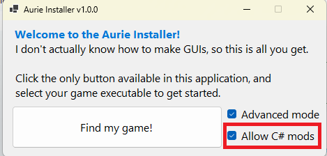
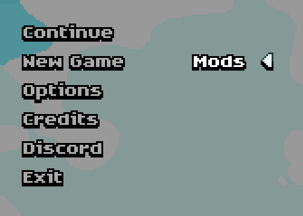
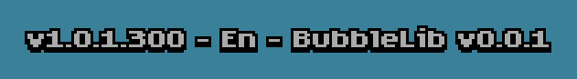

# BubbleLib
BubbleLib is a Framework and Modloader for the wonderful [Shelldiver](https://store.steampowered.com/app/3862670/Shelldiver/) by Gagonfe
it uses [YYToolkit](https://github.com/AurieFramework/YYToolkit) and [AurieSharp](https://github.com/AurieFramework/AurieSharp) to attach to the compiled GMK-YYC code.

It is currently in its very early stages but provides basic functionality for making and loading mods.

# How to install (End-User/Player)

## Installing Aurie

Download and run AurieInstaller [HERE](https://github.com/AurieFramework/Aurie/releases/latest)

Make sure to selecte "Allow C# mods" in the lower right

Click "Find my game!" and select your Shelldiver.exe file
(ususally in C:\Program Files (x86)\Steam\steamapps\common\Shelldiver)

## Installing BubbleLib

Download the latest version of BubbleLib from [HERE](https://github.com/TP-repo/BubbleLib/releases/latest)

Extract it, it should contain a "mods" folder, just drop that into your Shelldiver directory and you are done. (If it doesnt, drop the BubbleLib.dll into /mods/managed/)

Once you start your game you should be able to see the "Mods" submenu on your main menu screen like this:

As well as your BubbleLib version at the bottom left:

## Installing Mods

Mods can be installed by dropping them into "mods/bubble/"

If the "bubble" subfolder does not exist, either start your game with BubbleLib installed or create it by hand.

Example Mods:
- SaveGameManager [HERE](https://github.com/TP-repo/BubbleLib/releases/latest-SGM)
- Fireworks [HERE](https://github.com/TP-repo/BubbleLib/releases/latest-Fireworks)
